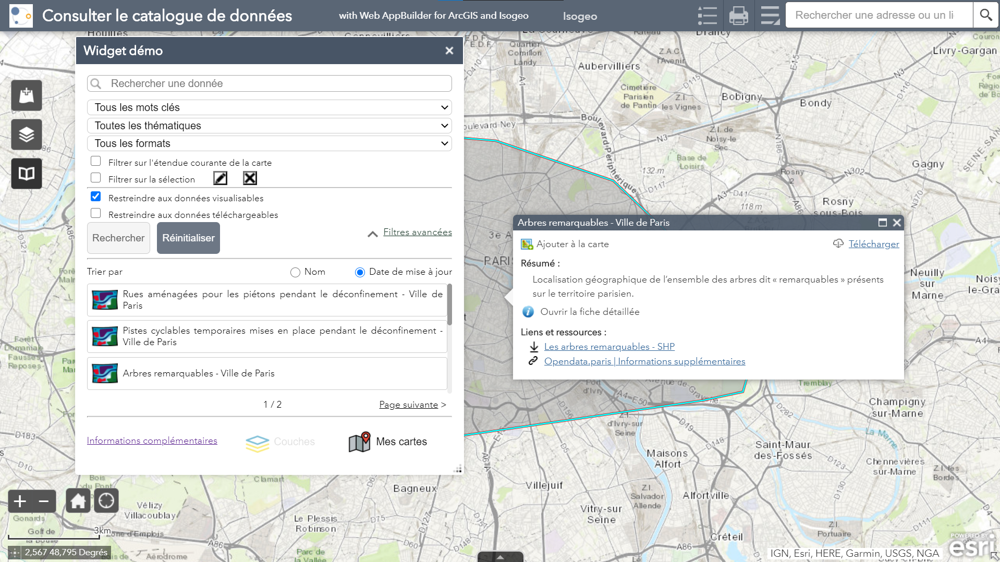

# Widget Web AppBuilder - ESRI Isogeo

## Présentation

A l'instar de tous les plugins/widgets développés à partir de l’API Isogeo, il vise à faciliter la découverte et l’usage des données cataloguées directement dans les différentes interfaces SIG. C’est la solution idéale pour valoriser les données et services SIG en interne dans les applications web générées.

Ainsi, il se présente sous la forme d'un “moteur de recherche” intégré à l'interface, qui permet de trouver des données, de les ajouter à sa carte et d'en savoir plus sur la donnée (historique, précision, conditions de diffusion, contact, etc.). Ce moteur de recherche est techniquement connecté aux catalogues de la plateforme Isogeo.

Grâce au moteur d'indexation Isogeo, vous pourrez accéder en quelques clics à vos données, celles de vos partenaires et aux données ouvertes (INSPIRE & Opendata) sans quitter votre environnement de travail.

Les différents plugins et widgets partagent une base fonctionnelle commune, résumé ci-après : 

* Rechercher une donnée dans le catalogue, en s’appuyant sur le système de filtres et de tri ;
* Consulter la fiche de métadonnées dans une fenêtre dédiée ;
* Visualiser l’emprise de la donnée (ou même son enveloppe convexe) sur la carte ;
* Afficher la donnée dans l'interface cartographique via les ressources et services renseignées dans Isogeo ;

### Exemples en ligne {#online_samples}

Si le widget est souvent intégré dans les applications webs internes, certains exemples sont disponibles en consultation en ligne :

* le widget de démonstration intégré au Portal Isogeo : [https://carto.isogeo.net/portal/apps/webappviewer/index.html?id=ee789033a9764b548d208b220c269d0e](https://carto.isogeo.net/portal/apps/webappviewer/index.html?id=ee789033a9764b548d208b220c269d0e)
* le widget de démonstration ArxIT dans une application Web AppBuilder dédiée : [https://isogeo-demo1.arxit.com/](https://isogeo-demo1.arxit.com/)
* celui de la métropole de Dijon pour ses données Open Data et qui a bénéficié d'un couplage spécifique à l'OpenCatalog : [https://catalog-carto.dijon.fr/#CarteInteractive](https://catalog-carto.dijon.fr/#CarteInteractive)

### Vidéo de présentation {#video}

L'application a été présentée lors du webinaire du 10 mai 2017 :


https://youtu.be/YWXbev6DETY?t=7m00s


---

## Caractéristiques

Le widget Web AppBuilder ESRI Isogeo est développé en partenariat avec la société [Arx iT](http://www.arxit.com/) à qui Isogeo sous-traite les développements, la maintenance et demandes d’évolutions. Il a bénéficié de l’expérience engrangée par arx iT sur Isogeo lors du projet [geomayenne](https://www.geomayenne.fr).

### Licence

Cette extension étant tributaire des architectures où elle est déployée, elle est considérée comme un développement spécifique et n’intègre donc pas les conditions de maintenance de la plateforme Isogeo. Une montée de version ou développement d’une évolution fait l’objet d’un chiffrage.

---

Date de la dernière mise à jour de cette documentation : {{ gitbook.time | date("DD/MM/YYYY") }}.
