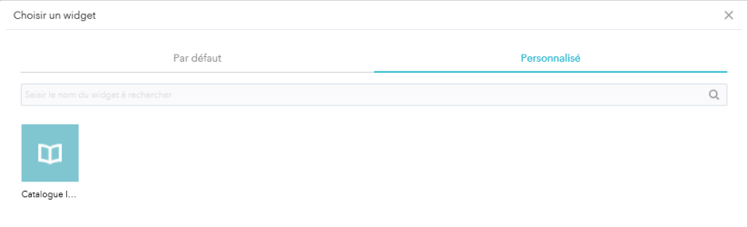
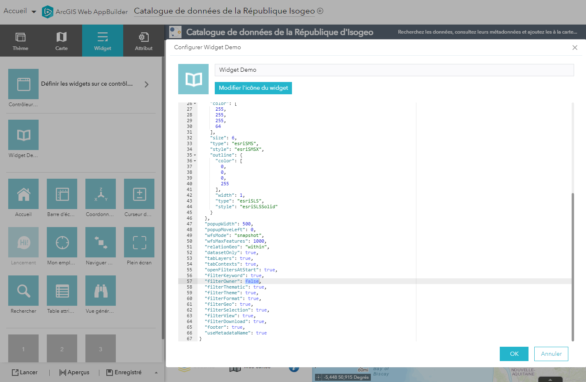
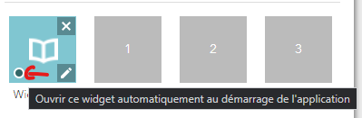

# Ajouter le widget à une application Web AppBuilder

1. Se connecter au Portal en tant qu'administrateur ;
2. Aller dans l'onglet `Contenu` ;
3. Créer une application à l'aide du WebAppBuilder ;
4. Ajouter le widget Isogeo dans l'onglet `Personnalisé`.

5. Il est possible d'éditer le fichier de configuration du widget directement depuis l'interface proposée par le Portal. La configuration s'appliquera uniquement à l'application (cf. [Autres configurations possibles](#config)).

6. Il est également possible de permettre l'ouverture du widget au démarrage de l'application en cochant la case suivante :

## Autres configurations possibles {#config}

Vous pouvez également modifier les paramètres suivants :

* apiUrl : url du proxy gérant les appels à l'api Isogeo (paramètre réservé à l'équipe Isogeo)
* useUrlSecrets : si le paramètre est à `true`, alors le Widget appelera le proxy hébergé par Isogeo (paramètre réservé à l'équipe Isogeo)
* share : identifiant du partage en cas d'utilisation d'un proxy local (paramètre réservé à l'équipe Isogeo)
* token : identifiant du token de sécurité en cas d'utilisation d'un proxy local (paramètre réservé à l'équipe Isogeo)
* link : lien vers la page de présentation du Widget sur le site officiel d'Isogeo
* resultSymbol : Symbole de type polygone au format ESRI Json
* resultSymbolPoint: Symbole de type point (donneés ne contenant pas d’emprise) au format ESRI Json
* popupWidth : largeur de la popup pour les métadonnées (400 pour les autres couches)
* popupMoveLeft : Décalage de la popup (pour les modèles d’applications nécessitant un décalage)
* wfsMode : "snapshot" (requête initiale uniquement) ou "ondemand" (requête à chaque déplacement, mais non
compatible avec tout les flux WFS)
* wfsMaxFeatures : Nombre maximal d’entités récupérées dans un flux wfs (1000 par défaut)
* relationGeo : Relation géographique pour les recherches par emprise
* errorMessageTime : Temps d'affichage du message d'erreur (3000 ms par défaut)
* dataset-only : Si le paramètre est à `true`, seules les fiches rasters, vecteurs et tabulaires non-géographiques seront proposées. Sinon les fiches de service et les fiches ressources seront également proposées dans la recherche 
* tabLayers : Afficher l'onglet Couches
* tabContexts : Afficher l'onglet Contexte
* openFiltersAtStart : Déplier tous les filtres à l'ouverture du Widget
* filterKeyword : Afficher le filtre sur les mots-clés
* filterOwner : Afficher le filtre sur le propriétaire
* filterThematic : Afficher le filtre sur les thématiques
* filterTheme : Afficher le filtre sur les thèmes Inspire
* filterFormat : Afficher le filtre sur les formats
* filterGeo : Afficher le filtre sur l'étendue de la carte
* filterSelection : Afficher le filtre sur une zone dessinée
* filterView : Afficher le filtre sur les données visualisables
* filterDownload : Afficher le filtre sur les données téléchargeables
* footer : Afficher le pied de page
* useMetadataName : Afficher le nom de la métadonnée comme nom du service/de la couche (dans les widgets *Legende* et *Liste des couches*) ou le nom ArcGIS Server par défaut.
* filterDomain : Afficher le filtre sur les domaines
* domains : Indiquer la liste des [thématiques](https://help.isogeo.com/admin/fr/features/admin/group_themes.html) que vous souhaitez afficher dans le filtre *Domaines* (s'il est activé) et non dans le filtre *Thématiques*. Indiquer les termes entre guillements et les séparer par des virgules.
* zoomOnAddedLayer : Zoommer la carte sur l'emprise de la couche de service après son ajout
* addMapServiceLayerAsFeatureLayer": Ajouter les données à la carte en tant que service ou en tant que couche. Dans le premier cas, c'est tout le Map Service qui est ajouté à la carte lorsqu'une couche est ajoutée.

> NB : Pour information, le portail chargera automatiquement la configuration saisie dans le fichier `catalog/config.json` à chaque ajout du widget dans une nouvelle application Web AppBuilder. Dans une application existante, il faut vérifier que l'utilisateur n'a pas modifié la configuration directement depuis le Portal (cf. [Ajouter le widget à une application Web AppBuilder](/installation-portal/addwidgetapplication.md))