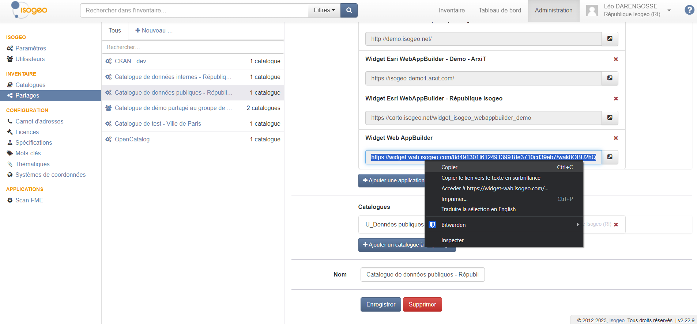
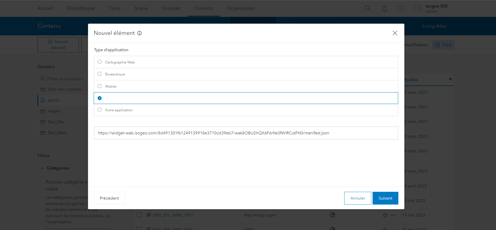

# Ajouter le Widget à Portal

1. Créer un [partage](https://help.isogeo.com/admin/fr/features/admin/shares.html) à l'application `Widget Web AppBuilder` sur la plateforme d'administration
2. Copier l'url du Widget comme sur la capture ci-dessous

3. Se connecter au Portal en tant qu'administrateur ;
4. Aller dans l'onglet `Contenu` ;
5. Cliquer sur `+Nouvel élément` puis `Application` ; 
6. Choisir le 4ème type d'application et coller l'url récupérée à l'étape 1 ; 
7. Renseigner le nom : `Widget Isogeo` ;
8. Renseigner un dossier : `Isogeo` ;
9. Renseigner des balises : `Widget`, `Catalogue`, `Isogeo` ;
10. Renseigner un résumé, par exemple : `Widget permettant la consultation du catalogue de métadonnées Isogeo et l'ajout de ces données à la carte.` ;
11. Enregistrer ;
12. Partager l'élément avec tout le monde ou à un groupe particulier selon le public visé.

> NB : L'url du Widget contenant l'idendifiant du partage correspondant dans Isogeo : vous pouvez donc référencer de la même manière le Widget pour un autre partage afin d'avoir un Widget pour l'interne et un Widget pour le grand public par exemple. 