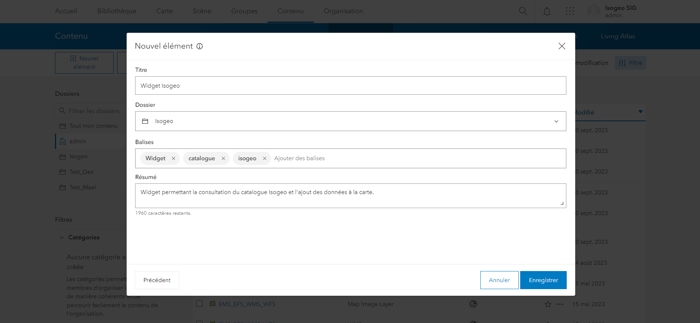
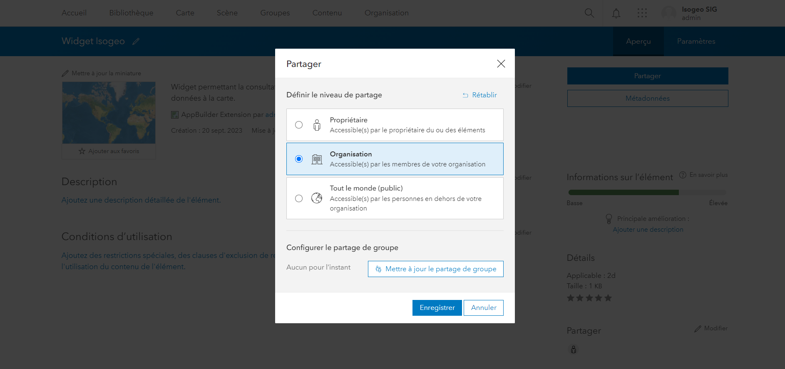

# Ajouter le Widget à Portal

1. Se connecter au Portal en tant qu'administrateur ;
2. Aller dans l'onglet `Contenu` ;
3. Créer un dossier Widget Isogeo, si besoin ;
4. Ajouter un élément, une application ;

5. Choisir une extension d’application (AppBuilder) ;
6. Renseigner l'URL : `https://mon-serveur/catalog/manifest.json` ;
7. Renseigner le nom : `Catalogue Isogeo ;
8. Renseigner une balise : `Isogeo`;

9. Valider ;
10. Partager l'élément avec tout le monde ou à un groupe particulier selon le public visé.

