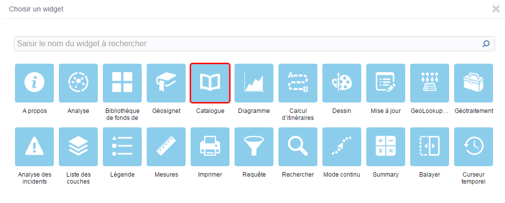

# Ajouter le widget à son application

## Au Web AppBuilder Developper Edition

1. Extraire le dossier « Catalog » contenant le Widget et l’ajouter au répertoire client\stemapp\widgets. \(Pour plus d'informations à ce sujet, consulter [l'aide Esri à ce sujet](https://developers.arcgis.com/web-appbuilder/guide/deploy-custom-widget-and-theme.htm).
2. Vous pouvez maintenant créer une nouvelle application et ajouter le Widget de la même façon que les Widgets standards :



---

## A une application téléchargée ArcGIS Online

1. Télécharger l’application depuis ArcGIS Online / Portal for ArcGIS ;
2. Modifier le fichier `env.js`. [Consulter l'aide Esri à ce sujet](https://developers.arcgis.com/web-appbuilder/sample-code/change-url-of-arcgis-api-for-javascript.htm) ;
3. Extraire le dossier « Catalog » contenant le Widget dans le répertoire Widgets ;
4. Référencer le widget en ajoutant le widget dans le fichier `config.json`, situé à la racine :

```js
{
    "name":"Catalog",
    "label":"Catalogue de données",
    "version":"1.0",
    "uri":"widgets/Catalog/Widget",
    "index":6,
    "id":"widgets_Catalog_Widget_37"
}
```


