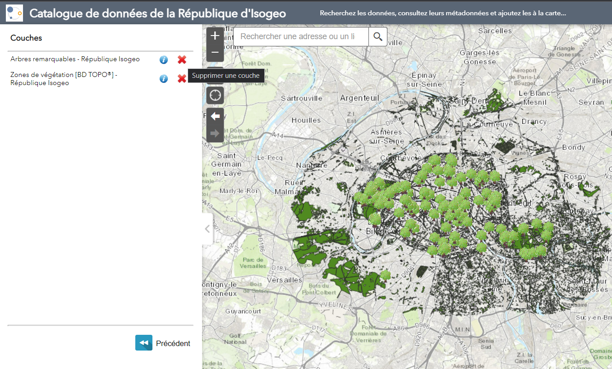

# Ajouter une donnée à la carte

Les métadonnées de données et de services peuvent permettre l'ajout d'une ou plusieurs couches de données dynamiquement à la carte.

## Données {#add-dataset}

Les métadonnées de type vecteur ou raster peuvent fournir une option d'ajout si au moins une couche de service web a été associée. Formats de services supportés :

* Web Feature Service \(WFS\)
* Web Map Service \(WMS\)
* Esri Feature Service \(EFS\)
* Esri Map Service \(EMS\)

Consulter [l'aide en ligne Isogeo au sujet du recensement automatisé des services et de l'association couche de service / donnée cataloguée](https://help.isogeo.com/fr/features/inventory/md_services/srv_intro.html).

> NB : Si plusieurs services sont associés à une même donnée. Le widget affichera en priorité les formats Esri.

## Services géographiques {#add-service}

Il est également possible d'ajouter l'ensemble des couches d'un service directement depuis la fiche de métadonnées correspondant au service. Formats supportés :

* Web Feature Service \(WFS\)
* Web Map Service \(WMS\)
* Esri Feature Service \(EFS\)
* Esri Map Service \(EMS\)

---

## Onglet Couches

Une fois les données ajoutées, il est alors possible de les retirer depuis l'onglet *Couches* ou de consulter à nouveau leur fiche détaillée.

## Onglet Mes cartes

Le widget offre également la possibilité de sauvegarder une carte après l'ajout de données.
Pour cela, il suffit de nommer la carte et de l'enregistrer dans l'onglet *Mes cartes*. Grace à cette fonctionnalité, l'utilisateur peut recharger une carte enregistrée à tout moment. Au besoin, il peut également supprimer une carte enregistrée.

> NB : Les informations sont stockées dans le navigateur de l'utilisateur, rien n'est écrit côté serveur.