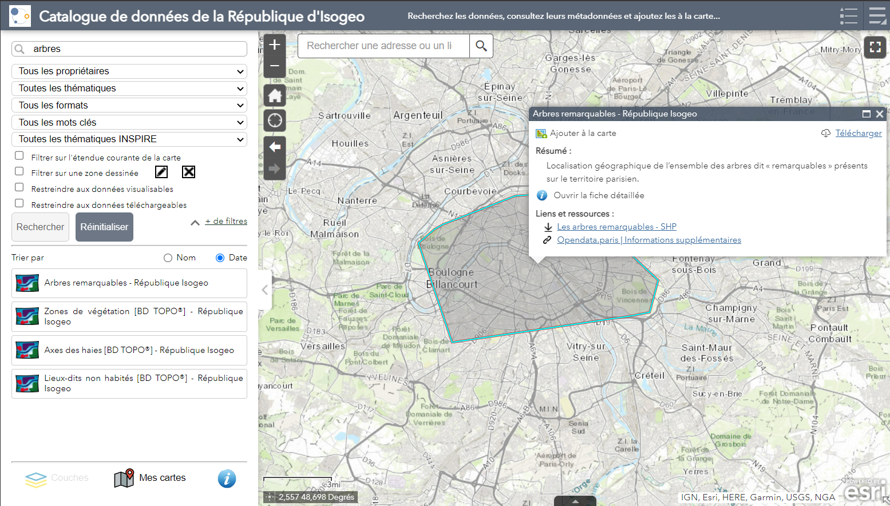
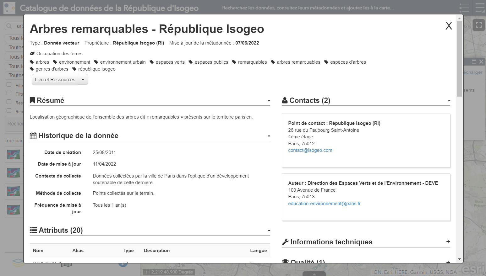

# Métadonnées

## Consulter le résumé {#abstract}

Dans la liste des résultats, le résumé de la métadonnées s'affiche au clic sur un résultat :

Un lien `Ouvrir la fiche détaillée` permet d'afficher la métadonnée complète (voir ci-dessous).

---

## Consulter la métadonnée détaillée {#metadata}

Il y 2 façons d'accéder à la fiche de métadonnée complète :

* depuis la fenêtre de résumé qui s'affiche au clic sur un résultat (voir ci-dessus)
* depuis le menu contextuel du widget liste des couches en cliquant sur lien `Fiche de métadonnées` :

> Cette deuxième possibilité est en option.

La fiche de métadonnée s'affiche alors dans une fenêtre modale :

