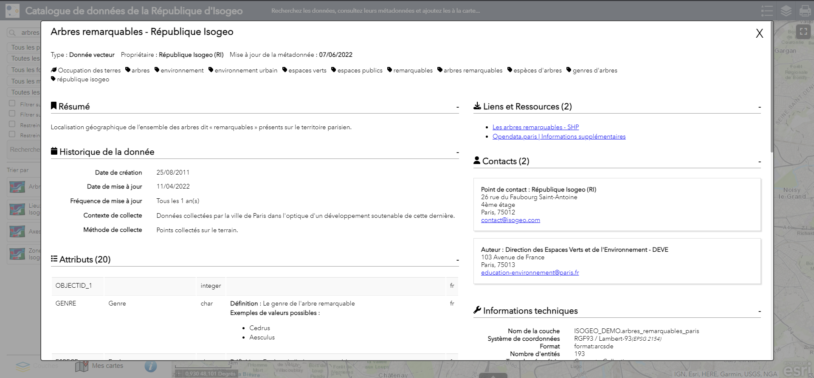

# Métadonnées {#metadata}

Au clic sur un résultat, le résumé et l'emprise de la métadonnée s'affichent :

Un lien `Ouvrir la fiche détaillée` permet d'afficher la métadonnée complète dans une fenêtre modale.

Si au moins une couche de service est associée à la métadonnée, il est possible d'[ajouter la donnée à la carte](../../fr/display.md).
Si au moins un lien de téléchargement est associé à la métadonnée, un bouton *Télécharger* s'affiche. 