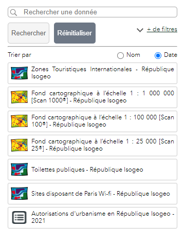
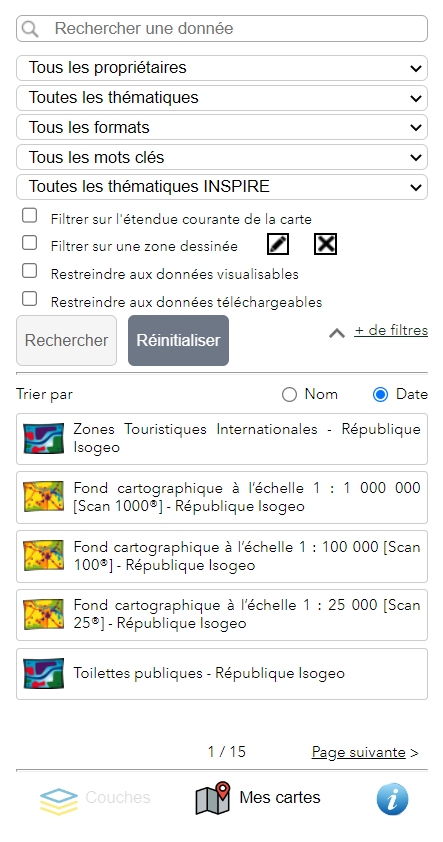

# Rechercher

Le widget de recherche Isogeo s'ouvre au clic sur l'icône (située en haut à droite par défaut) : .

Deux modes de recherche sont proposés :

* standard
* avancé

## Recherche standard {#search_standard}

Par défaut, seul le champ de recherche libre et les options de tri (ordre alphabétique des titres des métadonnées et date de mise à jour des données) sont affichés :

---

## Recherche avancée {#search_advanced}

En cliquant sur le lien déroualnt `Filtres avancés`, des options de recherche supplémentaires s'affichent :

